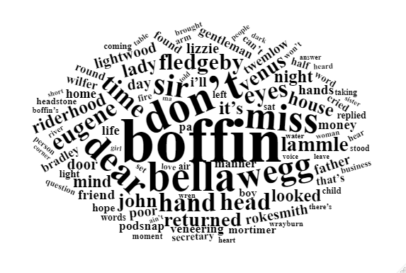
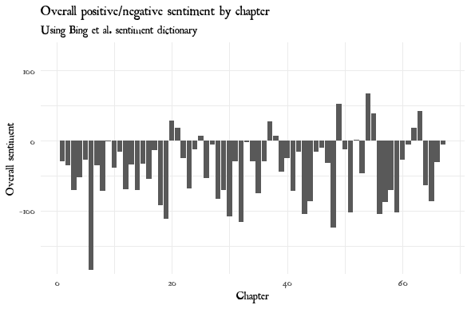
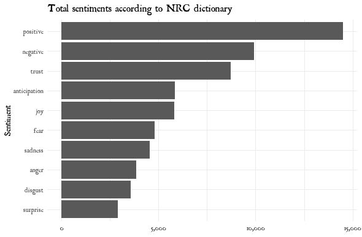

# Various text analysis projects

Currently I'm reading *Our Mutual Friend* by Charles Dickens. It's like nothing I've ever read. I was wondering, "What would a computer think of this book?"

Here I'll share what I find! I am indebted to [Julia Silge](https://twitter.com/juliasilge) and [David Robinson](https://twitter.com/drob)'s [*Text Mining with R*](https://www.tidytextmining.com/) for getting me started.

## The obligatory wordcloud

When I first started the book, I would never have guess that the "Boffinses" played such a central role. But here they are, literally at the center of the wordcloud!

## Sentiment analysis

