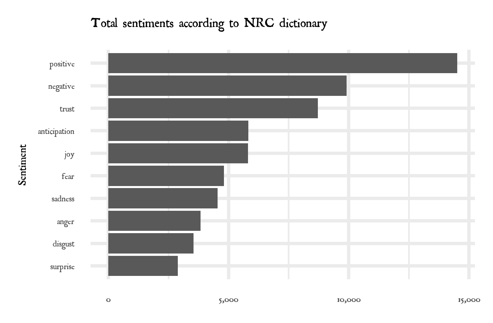

# Various text analysis projects

## *Our Mutual Friend*

Currently I'm reading *Our Mutual Friend* by Charles Dickens. It's like nothing I've ever read. I was wondering, "What would a computer think of this book?"

Here I'll share what I find! I am indebted to [Julia Silge](https://twitter.com/juliasilge) and [David Robinson](https://twitter.com/drob)'s [*Text Mining with R*](https://www.tidytextmining.com/) for getting me started.

### Sentiment analysis

I used the Bing et al. sentiment lexicon, which marks each word as either "positive" or "negative", to get an idea of the ups and downs and overall trajectory of the book. We see that it spends a lot of time in negative territory, punctuated with some lighter chapters, and eventually returns to about level. Phew, we've got plenty of drama, but we're not strapping in for some spiraling tragedy.

The NRC lexicon labels words as positive or negative, but also as potentially joyous, fearful, marking anticipation or disgust, etc. Interestingly, though the Bing analysis tells us that we spend most of our time in negative sentiment, NRC gives a more positive view. Not only are there more positive than negative words, but there is more trust and joy than fear, sadness, or anger; plenty of anticipation, not so much disgust. However I was surprised to see "surprise" come in last.

### The obligatory wordcloud

When I first started the book, I would never have guessed that the "Boffinses" played such a central role. But here they are, literally at the center of the wordcloud:

